#  LGA LAYOUT TOOL PACK

**Lega | v2.51**

## Instalación

- Copiar la carpeta **LGA_ToolPack-Layout** que contiene todos los
  archivos **.py** a **%USERPROFILE%/.nuke**.

- Con un editor de texto, agregar esta línea de código al archivo
  **init.py** que está dentro de la carpeta **.nuke**:

  ```
  nuke.pluginAddPath('./LGA_ToolPack-Layout')
  ```

- El ToolPack permite **activar/desactivar** herramientas sin tocar
  código editando el archivo **\_LGA_ToolPackLayout_Enabled.ini**
  (dentro de **LGA_ToolPack-Layout**/).\
  Por defecto todas las herramientas están en **True**. Cambiar a
  **False** las oculta y evita cargar su script.

> Para conservar la configuración en futuras actualizaciones, se puede
> copiar el archivo a **\~/.nuke/\_LGA_ToolPackLayout_Enabled.ini**
>
> Si existen ambos, tiene prioridad el de **\~/.nuke/.**

**Add Dots before (aka Dots) v5.1 - Alexey Kuchinski \| Mod Lega
v2.2**

[[https://www.nukepedia.com/python/nodegraph/dots]{.underline}](https://www.nukepedia.com/python/nodegraph/dots)

Agrega *Dots* antes del nodo seleccionado, generando líneas de conexión
con los nodos previos a 90 grados.

Si el nodo seleccionado está en la misma columna que el nodo conectado,
los alinea. Util para cuando se crea un nuevo nodo y no está alineado al
anterior.


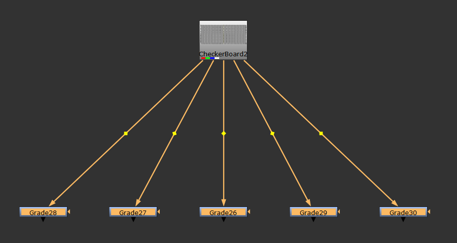
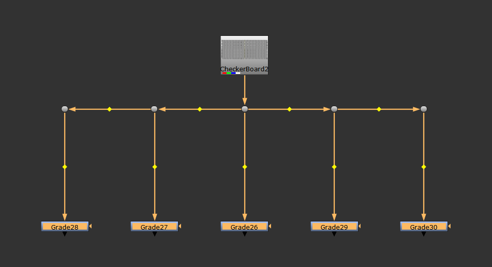

*La mod del pack tiene varios fixes y suma la función de armar un árbol
cuando varios nodos seleccionados están conectados al mismo nodo y
permite agregar dots en cualquier input siempre y cuando el nodo
conectado al input no esté en la misma fila o columna que el nodo
seleccionado.*

Shortcut: ***,***

#### **Add Dots after v1.6 - Lega**

Agrega un nodo Dot debajo del nodo seleccionado y luego otro Dot
conectado a este hacia la derecha o hacia la izquierda según el
shortcut.


Shortcuts:

***Shift + ,*** agrega el segundo Dot a la izquierda del primero

***Ctrl + shift + ,*** agrega el segundo Dot más a la izquierda del
primero

***Shift + .*** agrega el segundo Dot a la derecha del primero

***Ctrl + shift + .*** agrega el segundo Dot más a la derecha del
primero

**Create \| Edit StickyNote v1.0 -
Lega**

Permite crear o editar un StickyNote seleccionado con algunas opciones
extras.

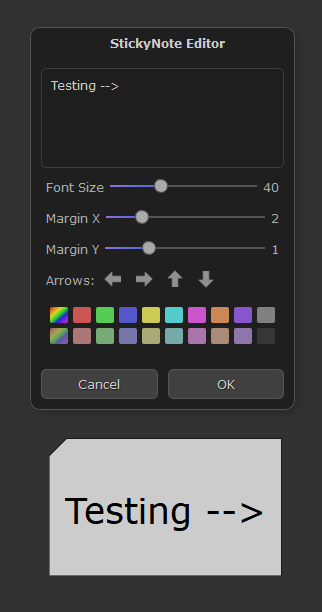

Shortcut:

***Shift + N*** crea un nuevo StickyNote o edita el StickyNote
seleccionado

**Create LGA_Backdrop v1.0 -
Lega**

Reemplazo del autoBackdrop, con opciones extras:

- Resize basado en un margen, tomando en cuenta los nodos dentro del
  backdrop.

- Z order automatico.

- Dos filas de colores random y predeterminados, la segunda es con menos
  saturación.


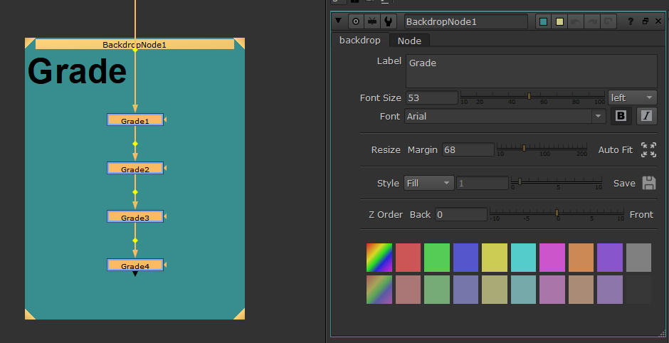

Shortcuts:

***Shift + B*** crea un nuevo LGA_Backdrop

***Ctrl + B*** reemplaza backdrops seleccionados (o todos) por
LGA_Backdrop

**Label Node v1.0 - Lega**

Permite cambiar el label de un nodo con una ventana emergente.

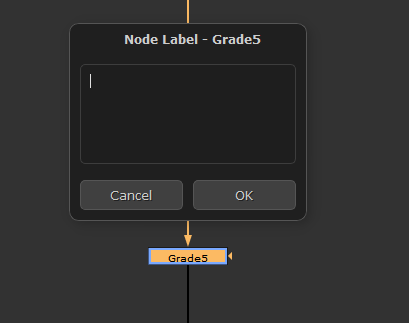

Shortcut: ***Shift + L***

**Select Nodes v1.3 - Lega**

A partir del nodo seleccionado selecciona nodos en la dirección
determinada por el shortcut.

- Select Nodes selecciona los nodos que están alineados con el nodo
  seleccionado. Es decir en la misma columna si la selección es hacia
  arriba o hacia abajo, o en la misma fila si es hacia los costados.

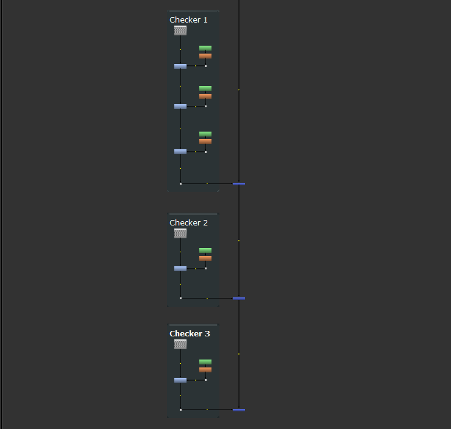
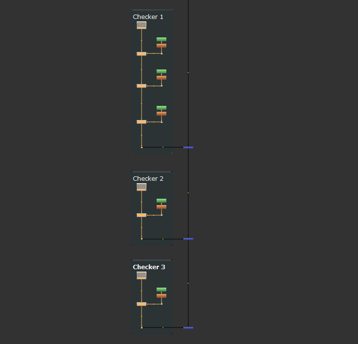

> Shortcuts (usando el teclado numérico):
>
> ***Alt + Flechas (2, 4, 6, 8)***

- Select connected Nodes hace lo mismo que *Select Nodes*, pero solo
  selecciona nodos que estén conectados con el nodo seleccionado, y
  recurrentemente con el nodo siguiente en la selección.


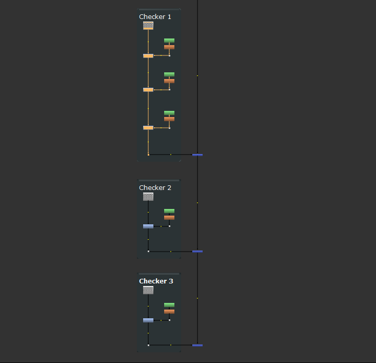

> Shortcuts (usando el teclado numérico):
>
> ***Meta + Flechas (2, 4, 6, 8)*** \*Meta es la bandera en windows o la
> manzana en mac

- Select all Nodes selecciona todos los nodos en la dirección
  determinada por el shortcut.


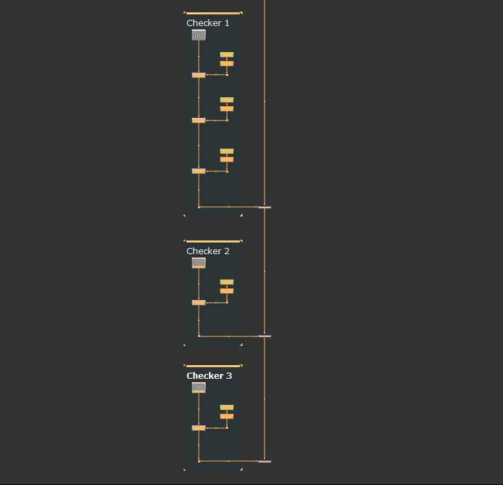

**Align Nodes v1.2 - Lega**

Alinea los nodos seleccionados según el shortcut.\
Si hay más de un backdrop seleccionado, en vez de alinear nodos, alinea
backdrops.

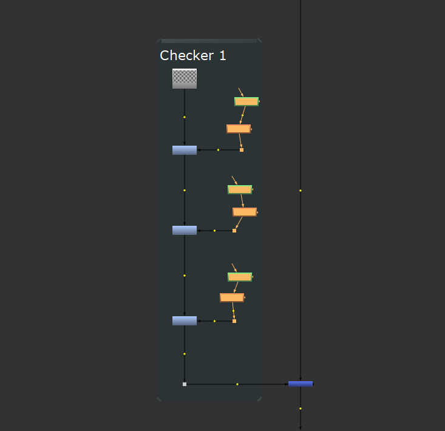


Shortcuts (usando el teclado numérico):

> ***Ctrl + Flechas (2, 4, 6, 8)***

**Distribute Nodes v1.1 -
Lega**

Distribuye horizontalmente o verticalmente los nodos seleccionados según
el shortcut. Cuando distribuye horizontalmente tiene en cuenta la altura
de cada nodo para dejar el mismo espacio libre entre todos los nodos.\
Si hay más de un backdrop seleccionado, en vez de distribuir nodos,
distribuye backdrops.

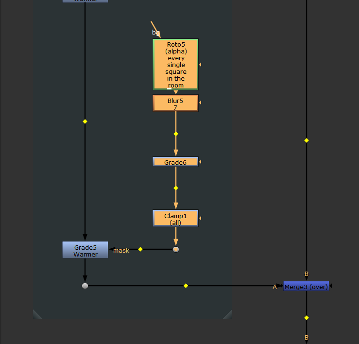
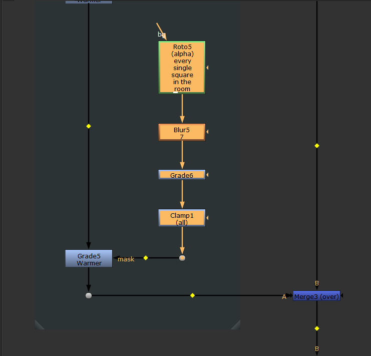

Shortcuts (usando el teclado numérico):

> ***Ctrl + 0*** Horizontal \* El 0 es más ancho horizontalmente en el
> teclado numérico que el punto
>
> ***Ctrl + .*** Vertical

**Arrange Nodes v0.81 - Lega**

Alinea y distribuye los nodos seleccionados de múltiples columnas
tomando en cuenta las conexiones de los nodos entre sí.\
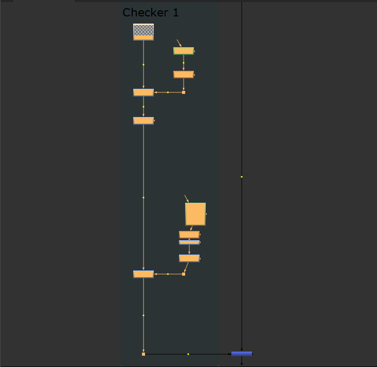
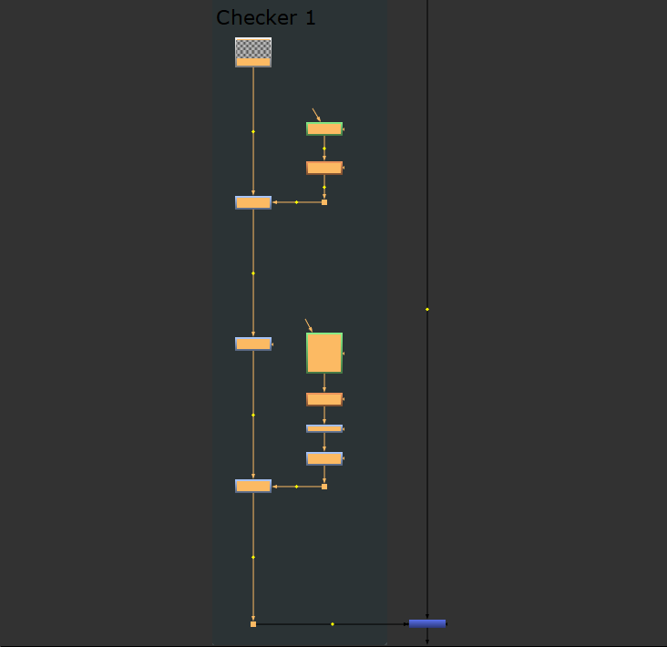

Shortcut (usando el teclado numérico):

> ***Ctrl + Flechas (2, 4, 6, 8)***

**Scale Nodes v1.0 - Erwan
Leroy**

Ajusta los espacios y la posición de los nodos seleccionados utilizando
un widget de escala.\

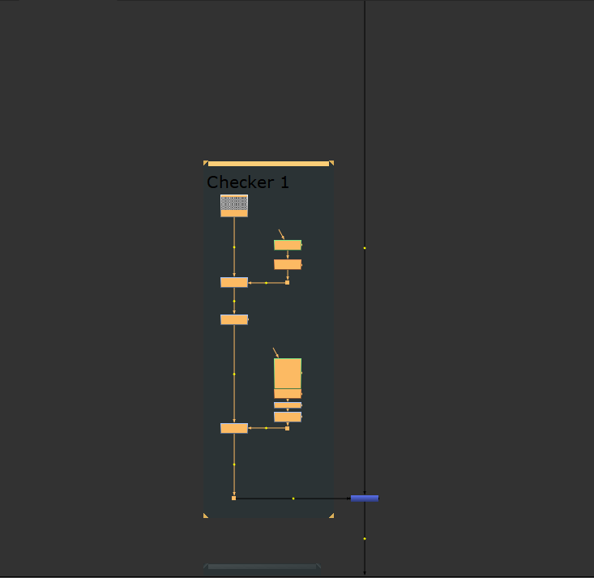

Shortcut (usando el teclado numérico):

> ***Ctrl + +***

**Push Nodes v1.0 - Mitja
Müller-Jend**

[[http://www.nukepedia.com/python/nodegraph/push_nodes]{.underline}](http://www.nukepedia.com/python/nodegraph/push_nodes)

Empuja nodos para crear espacio en la dirección correspondiente all
shortcut tomando como pivote la posición del puntero del mouse. Tiene en
cuenta los backdrops para generar espacios dentro sin mover los nodos de
otros backdrop, con lo cual es recomendable no dejar nodos sin un
backdrops. Útil para hacer lugar cuando hay que agregar nuevos nodos en
un sector sin espacio.

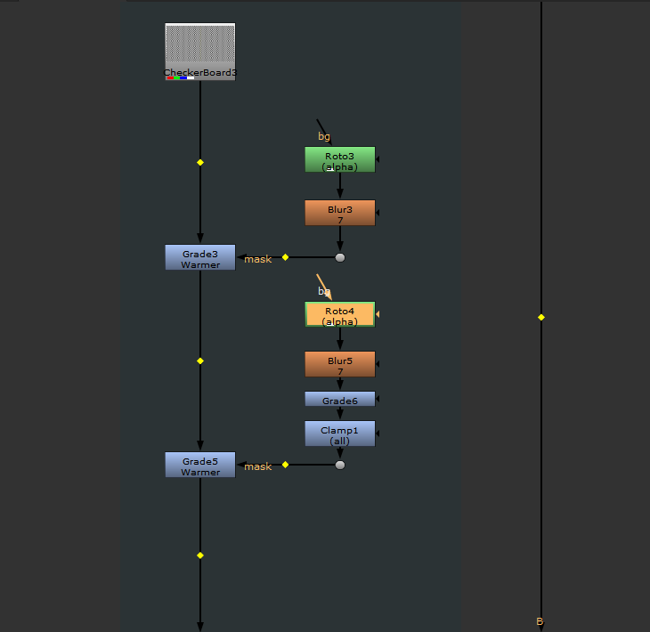
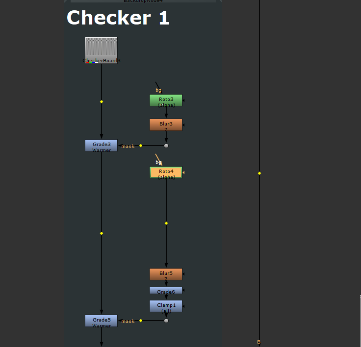

> Shortcuts (usando el teclado numérico):
>
> ***Ctrl + Alt + Flechas (2, 4, 6, 8)***

**Pull Nodes v1.0 - Mitja Müller-Jend \| Mod
Lega**

[[http://www.nukepedia.com/python/nodegraph/push_nodes]{.underline}](http://www.nukepedia.com/python/nodegraph/push_nodes)

Mod simple del *Push Nodes* para hacer exactamente lo contrario: Achicar
el espacio en la dirección correspondiente al shortcut tomando como
pivote el puntero del mouse.


> Shortcuts (usando el teclado numérico):
>
> ***Ctrl + Alt + Shift + Flechas (2, 4, 6, 8)***

**Easy Navigate v2.3 - Hossein
Karamian**

[[https://www.nukepedia.com/python/nodegraph/km-nodegraph-easy-navigate/]{.underline}](https://www.nukepedia.com/python/nodegraph/km-nodegraph-easy-navigate/)

Crea bookmarks de los nodos seleccionados y permite saltar rápidamente
de uno a otro. Util para scripts grandes.

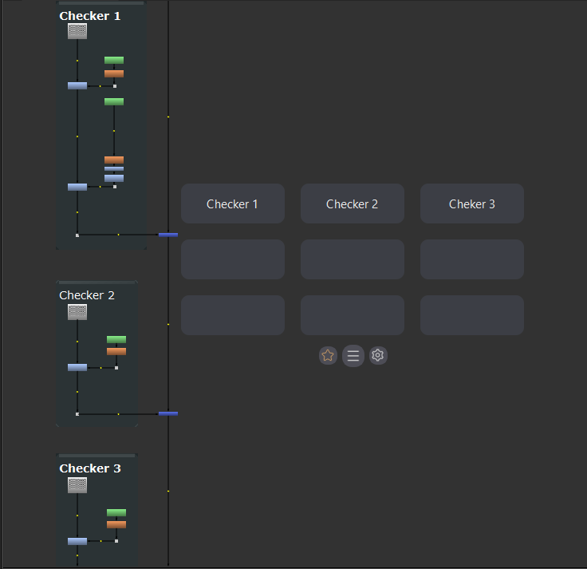

> Shortcuts:
>
> ***Shift + A*** Abre la GUI

**Toggle Zoom v1.1 - Lega**

Alterna entre el zoom actual y un zoom que muestra todos los nodos en el
Node Graph.

Permite volver al nivel de zoom anterior usando la posición del cursor
como centro. Si pasan más de 9 segundos entre pulsaciones de la tecla H,
se reinicia el ciclo.

> Shortcut: ***H***
