<p>
  
  <span style="font-size:1.6em;font-weight:700;line-height:1;">LGA LAYOUT TOOL PACK</span><br>
  <span style="font-style:italic;line-height:1;">Lega | v2.55</span>
</p>
<br clear="left">

## Instalación

- Copiar la carpeta **LGA_ToolPack-Layout** que contiene todos los
  archivos **.py** a **%USERPROFILE%/.nuke**.

- Con un editor de texto, agregar esta línea de código al archivo
  **init.py** que está dentro de la carpeta **.nuke**:

  ```
  nuke.pluginAddPath('./LGA_ToolPack-Layout')
  ```

- El ToolPack permite **activar/desactivar** herramientas sin tocar
  código editando el archivo **\_LGA_ToolPackLayout_Enabled.ini**
  (dentro de **LGA_ToolPack-Layout**/).\
  Por defecto todas las herramientas están en **True**. Cambiar a
  **False** las oculta y evita cargar su script.\
  Para conservar la configuración en futuras actualizaciones, se puede
  copiar el archivo a **\~/.nuke/\_LGA_ToolPackLayout_Enabled.ini**. Si
  existen ambos, tiene prioridad el de **\~/.nuke/.**
<br><br>

##  Add Dots before (aka Dots) v5.1 | Alexey Kuchinski <font color="#8a8a8a">| Mod Lega v2.2</font>

[https://www.nukepedia.com/python/nodegraph/dots](https://www.nukepedia.com/python/nodegraph/dots)<br>
Agrega *Dots* antes del nodo seleccionado, generando líneas de conexión
con los nodos previos a 90 grados.<br>
Si el nodo seleccionado está en la misma columna que el nodo conectado,
los alinea. Útil para cuando se crea un nuevo nodo y no está alineado al
anterior.

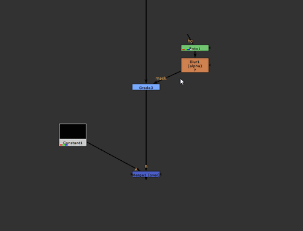
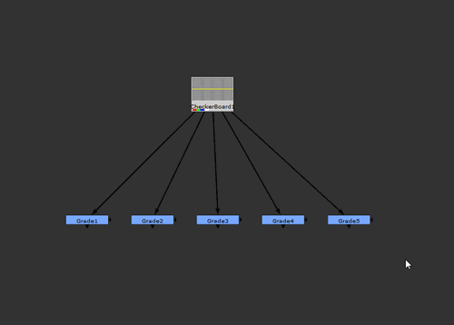

*La mod del pack tiene varios fixes y suma la función de armar un árbol
cuando varios nodos seleccionados están conectados al mismo nodo y
permite agregar dots en cualquier input siempre y cuando el nodo
conectado al input no está en la misma fila o columna que el nodo
seleccionado.*<br><br>
<strong><font color="#8a8a8a">Shortcut:</font> <font color="#8a8a8a">,</font></strong>
<br><br>

##  Add Dots after v1.6 | Lega

Agrega un nodo Dot debajo del nodo seleccionado y luego otro Dot
conectado a este hacia la derecha o hacia la izquierda según el
shortcut.

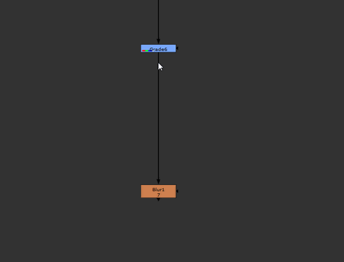

<strong><font color="#8a8a8a">Shortcuts:</font></strong><br>
<font color="#8a8a8a">***Shift + ,*** agrega el segundo Dot a la izquierda del primero<br>
***Ctrl + shift + ,*** agrega el segundo Dot más a la izquierda del primero<br>
***Shift + .*** agrega el segundo Dot a la derecha del primero<br>
***Ctrl + shift + .*** agrega el segundo Dot más a la derecha del primero</font><br>
<br>

##  Script Checker v0.87 | Lega

Analiza todos los nodos del script y detecta conexiones que no respetan ciertas reglas de orden y convenciones de layout.<br>
La herramienta lista en una tabla unicamente los nodos que no cumplen estas reglas. Para cada nodo muestra:<br>
<strong>Node:</strong> nombre del nodo detectado.<br>
<strong>Input A / Input B / Input Mask:</strong> que nodo esta conectado en cada entrada.<br>
<strong>Posicion actual:</strong> la direccion donde se encuentra cada conexion (left, right, top, etc.).<br>
<strong>Posicion esperada:</strong> en rojo, la ubicacion correcta segun las reglas definidas.<br>
Esto permite identificar rapidamente conexiones incorrectas o desordenadas dentro del script.<br>
<br>
<strong>Al hacer clic en una fila:</strong><br>
&bull; Selecciona el nodo en el Node Graph.<br>
&bull; Ejecuta zoom to fit.<br>
&bull; Abre el panel de propiedades del nodo.<br>
De esta forma se puede corregir el problema rapidamente. El boton Refresh vuelve a ejecutar el analisis despues de ajustar las conexiones.


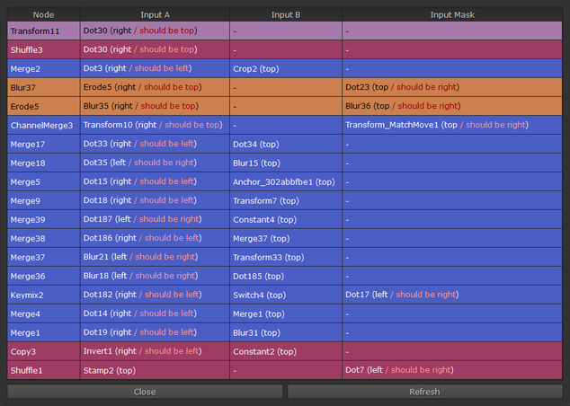


<strong><font color="#8a8a8a">Shortcut:</font></strong><br>
<font color="#8a8a8a">***Ctrl + Alt + H*** abre la ventana con el listado de resultados</font><br>
<br>

##  StickyNote v1.0 | Lega

Permite crear o editar un StickyNote seleccionado con algunas opciones
extras.

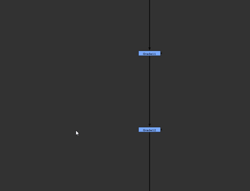

<strong><font color="#8a8a8a">Shortcut:</font></strong><br>
<font color="#8a8a8a">***Shift + N*** crea un nuevo StickyNote o edita el StickyNote seleccionado</font><br>
<br>

##  Create LGA_Backdrop v1.0 | Lega

Reemplazo del autoBackdrop, con opciones extras:<br>
- Resize basado en un margen, tomando en cuenta los nodos dentro del backdrop.<br>
- Z order automatico.<br>
- Dos filas de colores random y predeterminados, la segunda es con menos saturación.

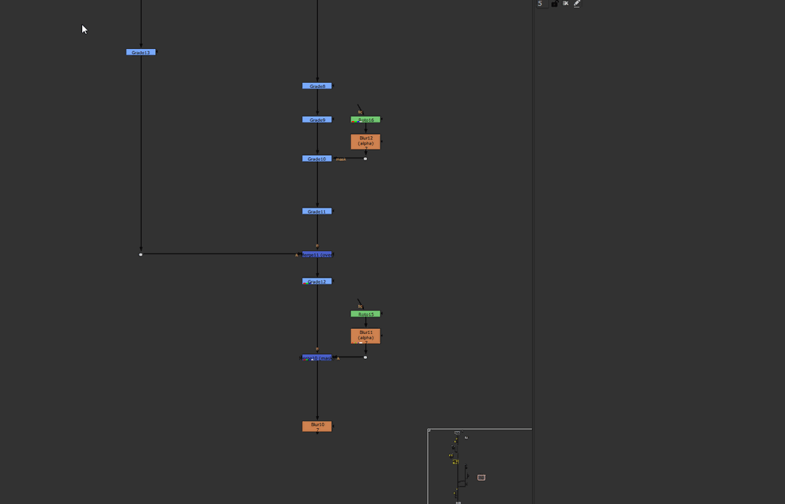

<strong><font color="#8a8a8a">Shortcuts:</font></strong><br>
<font color="#8a8a8a">***Shift + B*** crea un nuevo LGA_Backdrop<br>
***Ctrl + B*** reemplaza backdrops seleccionados (o todos) por LGA_Backdrop</font><br>
<br>

##  Label Node v1.0 | Lega

Permite cambiar el label de un nodo con una ventana emergente.

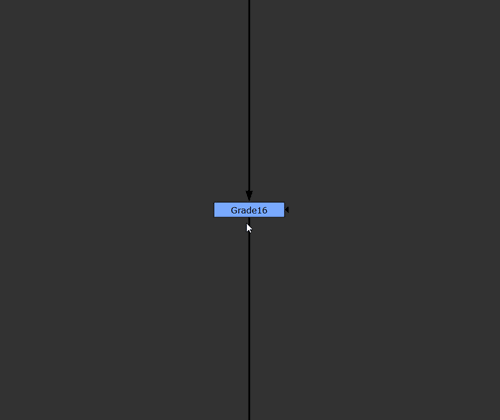

<strong><font color="#8a8a8a">Shortcut:</font></strong><br>
<font color="#8a8a8a">***Shift + L***</font><br>
<br>

##  Select Nodes v1.3 | Lega

A partir del nodo seleccionado selecciona nodos en la dirección
determinada por el shortcut.

- <span style="color:#914dcb;font-weight:600;">Select Nodes</span> selecciona los nodos que están alineados con el nodo
  seleccionado sin importar si están o no conectados entre sí.<br>
  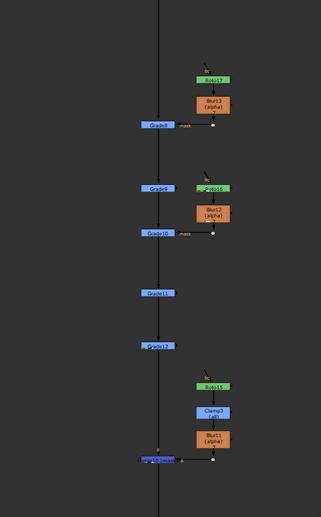<br>
  <strong><span style="color:#8a8a8a;">Shortcuts</span></strong> <span style="color:#8a8a8a;">(usando el teclado numérico):</span><br>
  <span style="color:#8a8a8a;">***Alt + ↓ (2)***</span><br>
  <span style="color:#8a8a8a;">***Alt + ↑ (8)***</span><br>
  <span style="color:#8a8a8a;">***Alt + ← (4)***</span><br>
  <span style="color:#8a8a8a;">***Alt + → (6)***</span><br><br>
- <span style="color:#914dcb;font-weight:600;">Select connected Nodes</span> hace lo mismo que *Select Nodes*, pero solo
  selecciona nodos que están conectados con el nodo seleccionado, y
  recurrentemente con el nodo siguiente en la selección.<br>
  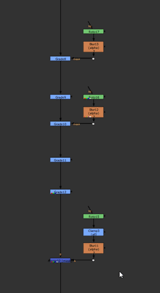<br>
  <strong><span style="color:#8a8a8a;">Shortcuts</span></strong> <span style="color:#8a8a8a;">(usando el teclado numérico):</span><br>
  <span style="color:#8a8a8a;">***Meta + ↓ (2)***</span><br>
  <span style="color:#8a8a8a;">***Meta + ↑ (8)***</span><br>
  <span style="color:#8a8a8a;">***Meta + ← (4)***</span><br>
  <span style="color:#8a8a8a;">***Meta + → (6)***</span><br>
  <span style="color:#aaaaaa;font-size:0.9em;">*Meta es la bandera en Windows o la manzana en macOS.</span><br><br>
- <span style="color:#914dcb;font-weight:600;">Select all Nodes</span> selecciona todos los nodos en la dirección
  determinada por el shortcut.<br>
  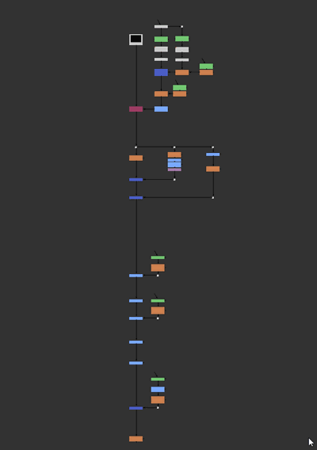

<br>

##  Align Nodes v1.2 | Lega

Alinea los nodos seleccionados según el shortcut.\
Si hay más de un backdrop seleccionado, en vez de alinear nodos, alinea
backdrops.

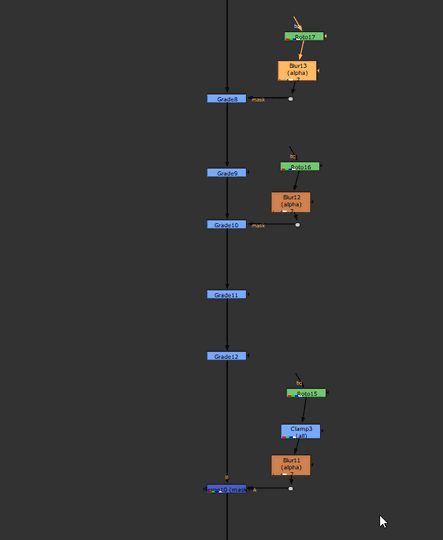

<strong><span style="color:#8a8a8a;">Shortcuts</span></strong> <span style="color:#8a8a8a;">(usando el teclado numérico):</span><br>
<span style="color:#8a8a8a;">***Ctrl + ↓ (2)***</span><br>
<span style="color:#8a8a8a;">***Ctrl + ↑ (8)***</span><br>
<span style="color:#8a8a8a;">***Ctrl + ← (4)***</span><br>
<span style="color:#8a8a8a;">***Ctrl + → (6)***</span><br>
<br>

##  Distribute Nodes v1.1 | Lega

Distribuye horizontalmente o verticalmente los nodos seleccionados según
el shortcut. Cuando distribuye verticalmente tiene en cuenta la altura
de cada nodo para dejar el mismo espacio libre entre todos los nodos.\
Si hay más de un backdrop seleccionado, en vez de distribuir nodos,
distribuye backdrops.

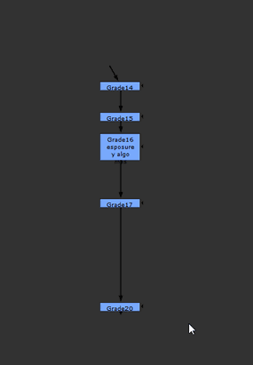

<strong><span style="color:#8a8a8a;">Shortcuts</span></strong> <span style="color:#8a8a8a;">(usando el teclado numérico):</span><br>
<span style="color:#8a8a8a;">***Ctrl + 0*** Horizontal <span style="font-weight:400;color:#8a8a8a;">(El 0 es más ancho en el teclado numérico que el punto)</span></span><br>
<span style="color:#8a8a8a;">***Ctrl + .*** Vertical</span><br>
<br>

##  Arrange Nodes v0.81 - Lega

Alinea y distribuye los nodos seleccionados de múltiples columnas
tomando en cuenta las conexiones de los nodos entre sí.\
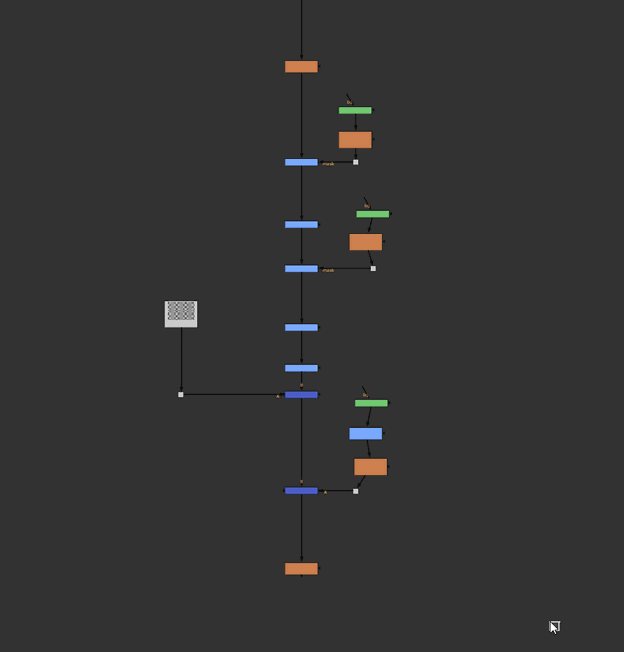

<strong><span style="color:#8a8a8a;">Shortcuts</span></strong> <span style="color:#8a8a8a;">(usando el teclado numérico):</span><br>
<span style="color:#8a8a8a;">***Ctrl + ↓ (2)***</span><br>
<span style="color:#8a8a8a;">***Ctrl + ↑ (8)***</span><br>
<span style="color:#8a8a8a;">***Ctrl + ← (4)***</span><br>
<span style="color:#8a8a8a;">***Ctrl + → (6)***</span><br>
<br>

##  Scale Nodes v1.0 - Erwan Leroy

Ajusta los espacios y la posición de los nodos seleccionados utilizando
un widget de escala.\
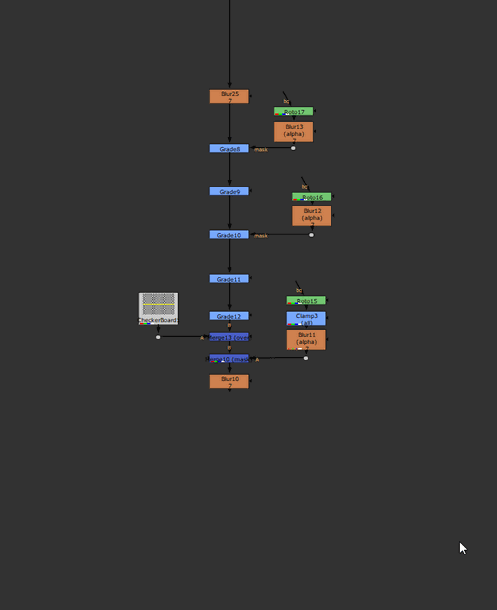

<strong><span style="color:#8a8a8a;">Shortcuts</span></strong> <span style="color:#8a8a8a;">(usando el teclado numérico):</span><br>
<span style="color:#8a8a8a;">***Ctrl + +***</span><br><br>


##  Push Nodes v1.0 - Mitja Müller-Jend

[http://www.nukepedia.com/python/nodegraph/push_nodes](http://www.nukepedia.com/python/nodegraph/push_nodes)<br>
Empuja nodos para crear espacio en la dirección correspondiente al
shortcut tomando como pivote la posición del puntero del mouse. Tiene en
cuenta los backdrops para generar espacios dentro sin mover los nodos de
otros backdrop, con lo cual es recomendable no dejar nodos sin un
backdrops. Útil para hacer lugar cuando hay que agregar nuevos nodos en
un sector sin espacio.

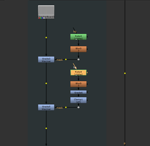
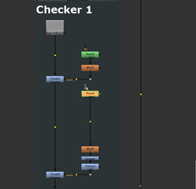

<strong><span style="color:#8a8a8a;">Shortcuts</span></strong> <span style="color:#8a8a8a;">(usando el teclado numérico):</span><br>
<span style="color:#8a8a8a;">***Ctrl + Alt + ↓ (2)***</span><br>
<span style="color:#8a8a8a;">***Ctrl + Alt + ↑ (8)***</span><br>
<span style="color:#8a8a8a;">***Ctrl + Alt + ← (4)***</span><br>
<span style="color:#8a8a8a;">***Ctrl + Alt + → (6)***</span><br><br>


##  Pull Nodes v1.0 - Mitja Müller-Jend \| Mod Lega

[http://www.nukepedia.com/python/nodegraph/push_nodes](http://www.nukepedia.com/python/nodegraph/push_nodes)<br>
Mod simple del *Push Nodes* para hacer exactamente lo contrario: Achicar
el espacio en la dirección correspondiente al shortcut tomando como
pivote el puntero del mouse.


<strong><span style="color:#8a8a8a;">Shortcuts</span></strong> <span style="color:#8a8a8a;">(usando el teclado numérico):</span><br>
<span style="color:#8a8a8a;">***Ctrl + Alt + Shift + ↓ (2)***</span><br>
<span style="color:#8a8a8a;">***Ctrl + Alt + Shift + ↑ (8)***</span><br>
<span style="color:#8a8a8a;">***Ctrl + Alt + Shift + ← (4)***</span><br>
<span style="color:#8a8a8a;">***Ctrl + Alt + Shift + → (6)***</span><br><br>


##  Easy Navigate v2.3 - Hossein Karamian

[https://www.nukepedia.com/python/nodegraph/km-nodegraph-easy-navigate/](https://www.nukepedia.com/python/nodegraph/km-nodegraph-easy-navigate/)<br>
Crea bookmarks de los nodos seleccionados y permite saltar rápidamente
de uno a otro. Útil para scripts grandes.


<strong><span style="color:#8a8a8a;">Shortcuts</span></strong><br>
<span style="color:#8a8a8a;">***Shift + A*** Abre la GUI</span><br><br>


##  Toggle Zoom v1.1 - Lega

Alterna entre el zoom actual y un zoom que muestra todos los nodos en el
Node Graph.<br>
Permite volver al nivel de zoom anterior usando la posición del cursor
como centro. Si pasan más de 9 segundos entre pulsaciones de la tecla H,
se reinicia el ciclo.

<strong><span style="color:#8a8a8a;">Shortcuts</span></strong><br>
<span style="color:#8a8a8a;">***H***</span><br>
<span style="color:#8a8a8a;">***Middle click***</span><br><br>

