<p align="right"><b>English</b> · <a href="README_ES.md">Español</a></p>

<p>
  
  <span style="font-size:1.6em;font-weight:700;line-height:1;">LGA LAYOUT TOOL PACK</span><br>
  <span style="font-style:italic;line-height:1;">Lega | v2.62</span>
</p>
<br clear="left">

## Installation

- Copy the **LGA_ToolPack-Layout** folder, which contains all the ToolPack files, to **%USERPROFILE%/.nuke**.<br> It should look like this:
   ```
   .nuke/
   +- LGA_ToolPack-Layout/
      +- menu.py
      +- py/
      +- ...
  ```

- Using a text editor, add this line of code to the **init.py** file inside the **.nuke** folder:

  ```
  nuke.pluginAddPath('./LGA_ToolPack-Layout')
  ```

- The pack lets you **turn tools on and off** from the **TPL > Enable Tools** menu, explained below.

- **TPL > What's new** shows what changed in each version of the pack.

<br>


## Enable Tools v1.05 | Lega

Choose which tools from the pack show up in the menu.<br>
Open it from **TPL > Enable Tools**. It shows a checkbox for each tool, grouped the same way as the menu. An unchecked tool is hidden from the menu and it also **is not loaded**, so turning off what you don't use also lightens Nuke's startup. Changes take effect after restarting Nuke.<br>
Your choice is saved **outside the pack**, in **%APPDATA%\LGA\ToolPack_Layout\Enabled.ini** (Windows) or **~/Library/Application Support/LGA/ToolPack_Layout/Enabled.ini** (macOS), so updating the pack doesn't overwrite it. The file path is shown at the very bottom, and you can click it to open it in the file browser.<br>
**All On** and **All Off** check and uncheck everything; **Reset** restores the factory defaults, which you still need to save with **Save**.

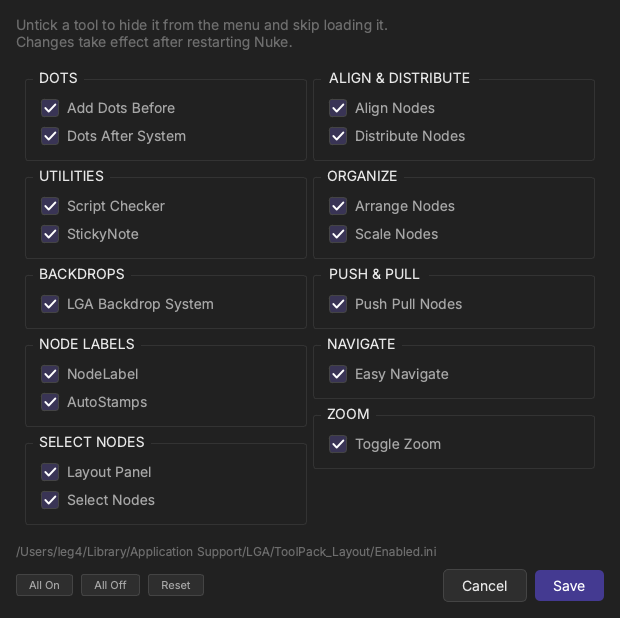

<br>


##  Add Dots before (aka Dots) v5.1 | Alexey Kuchinski <font color="#8a8a8a">| Mod Lega v2.2</font>

[https://www.nukepedia.com/python/nodegraph/dots](https://www.nukepedia.com/python/nodegraph/dots)<br>
Adds *Dots* before the selected node, creating connection lines
at 90 degrees to the upstream nodes.<br>
If the selected node is in the same column as the connected node,
it aligns them. Useful when you create a new node and it is not aligned with the
previous one.

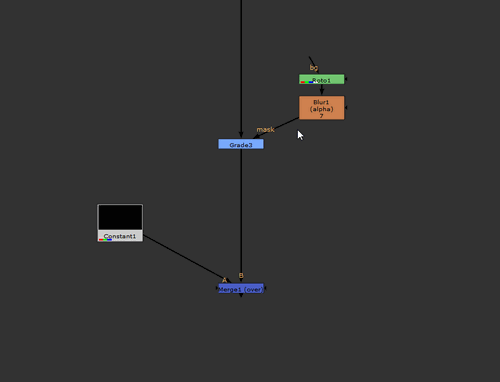
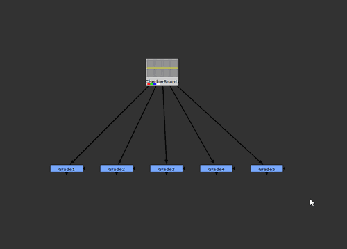<br>
*The pack's mod has several fixes and adds the ability to build a tree
when several selected nodes are connected to the same node, and
lets you add dots on any input, as long as the node
connected to that input is not in the same row or column as the
selected node.*
<br><br>


<br>


##  Add Dots after v1.6 | Lega

Adds a Dot node below the selected node, and then another Dot
connected to it, to the right or to the left depending on the
shortcut.

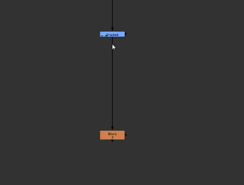


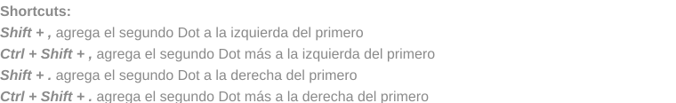

<br>


##  Script Checker v0.87 | Lega

Analyzes all the nodes in the script and finds connections that break certain ordering rules and layout conventions.<br>
The tool lists in a table only the nodes that break these rules. For each node it shows:<br>
<strong>Node:</strong> name of the detected node.<br>
<strong>Input A / Input B / Input Mask:</strong> which node is connected to each input.<br>
<strong>Current position:</strong> the direction where each connection is (left, right, top, etc.).<br>
<strong>Expected position:</strong> in red, the correct location according to the defined rules.<br>
This lets you quickly spot wrong or messy connections in the script.<br>
<br>
<strong>Clicking a row:</strong><br>
&bull; Selects the node in the Node Graph.<br>
&bull; Runs zoom to fit.<br>
&bull; Opens the node's properties panel.<br>
This way you can fix the problem quickly. The Refresh button runs the analysis again after you adjust the connections.


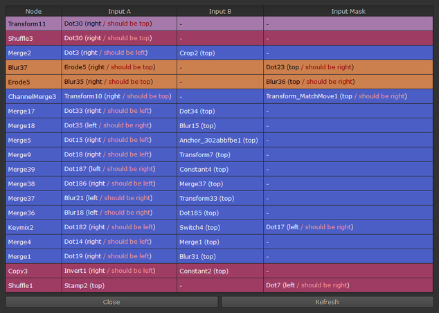
<br><br>


<br>


##  StickyNote v1.0 | Lega

Creates a StickyNote, or edits the selected one, with a few extra
options.

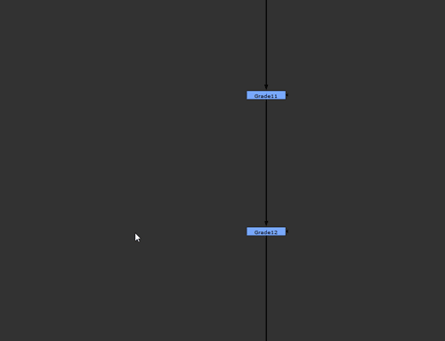
<br><br>


<br>


##  Create LGA_Backdrop v1.0 | Lega

A replacement for autoBackdrop, with extra options:
- Resize based on a margin, taking into account the nodes inside the backdrop.<br>
- Automatic Z order.<br>
- Two rows of random and preset colors; the second one is less saturated.

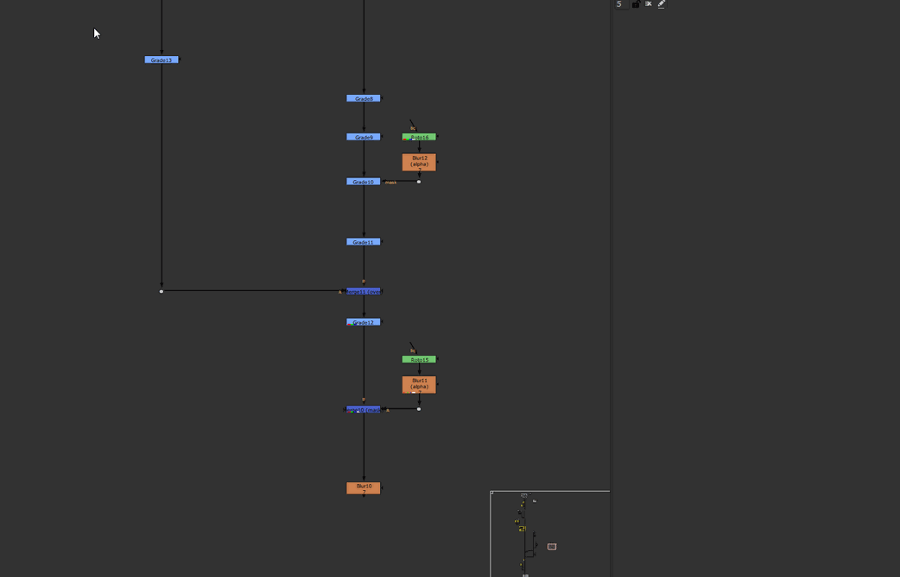


<br>


##  Label Node v1.0 | Lega

Changes a node's label through a popup window.

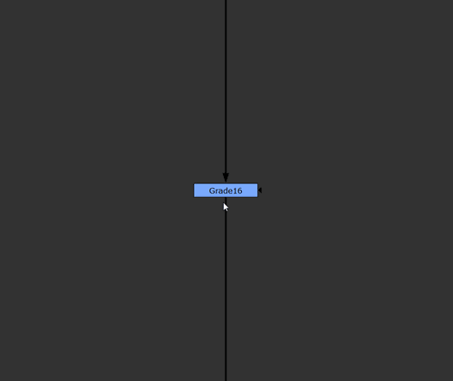
<br><br>


<br>


##  AutoStamps v0.70 | Lega

Finds "messy" connections in the Node Graph and automatically replaces them
with *Stamps* (Adrian Pueyo's system), leaving a cleaner, more readable tree.
It handles three cases:<br>
&bull; Very long connections between two distant nodes.<br>
&bull; A node that feeds its output to several destinations through Dots.<br>
&bull; Nodes with a *hidden input* (a hidden connection to a distant source).<br>
Before replacing each group, it shows a window to confirm and name the
Stamp, zooming automatically to the context (source node and destinations). Cancel reverts
that group, and a single *Ctrl+Z* undoes the whole operation.

<br>


##  Select Nodes v1.3 | Lega

Starting from the selected node, selects nodes in the direction
set by the shortcut.

- <span style="color:#914dcb;font-weight:600;">Select Nodes</span> selects the nodes that are aligned with the selected
  node, whether or not they are connected to each other.<br>
  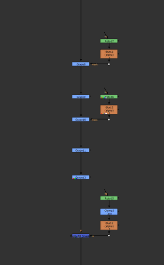<br>
  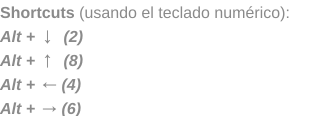<br><br>
- <span style="color:#914dcb;font-weight:600;">Select connected Nodes</span> does the same as *Select Nodes*, but only
  selects nodes connected to the selected node, and
  recursively to the next node in the selection.<br>
  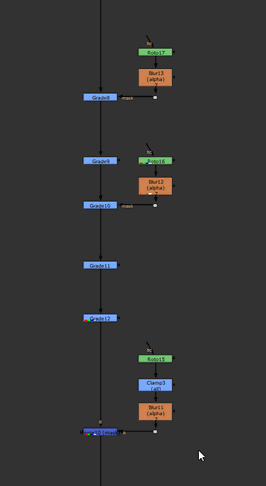<br>
  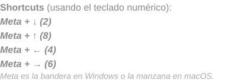<br><br>
- <span style="color:#914dcb;font-weight:600;">Select all Nodes</span> selects all nodes in the direction
  set by the shortcut.<br>
  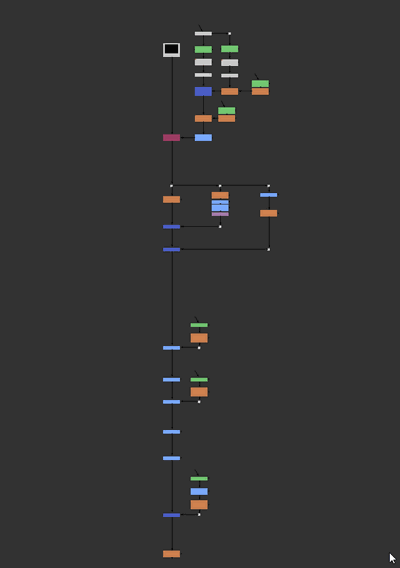

<br>


##  Align Nodes v1.2 | Lega

Aligns the selected nodes according to the shortcut.\
If more than one backdrop is selected, it aligns the backdrops
instead of the nodes.

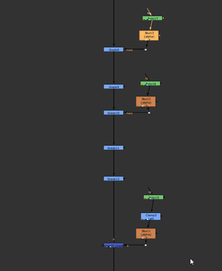

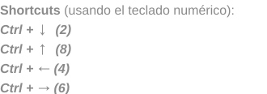

<br>


##  Distribute Nodes v1.1 | Lega

Distributes the selected nodes horizontally or vertically according to
the shortcut. When distributing vertically, it takes into account the height
of each node to leave the same free space between all nodes.\
If more than one backdrop is selected, it distributes the backdrops
instead of the nodes.

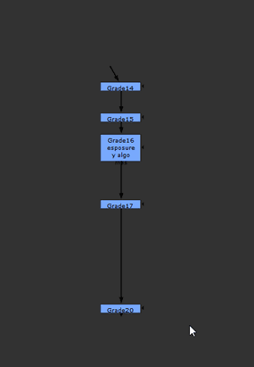

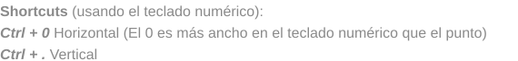

<br>


##  Arrange Nodes v0.81 | Lega

Aligns and distributes the selected nodes across multiple columns,
taking into account how the nodes are connected to each other.\
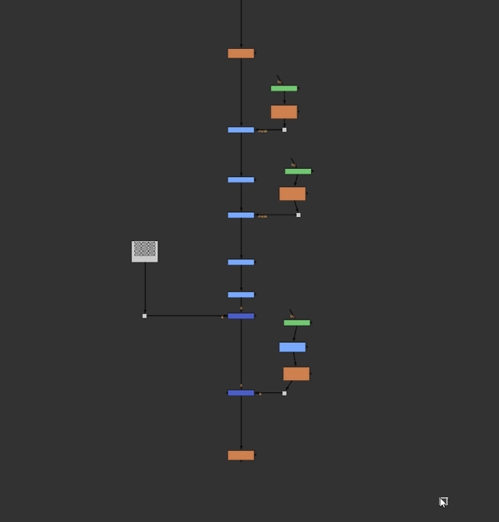

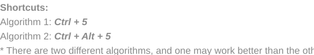

<br>


##  Scale Nodes v1.0 | Erwan Leroy

Adjusts the spacing and position of the selected nodes using
a scale widget.\
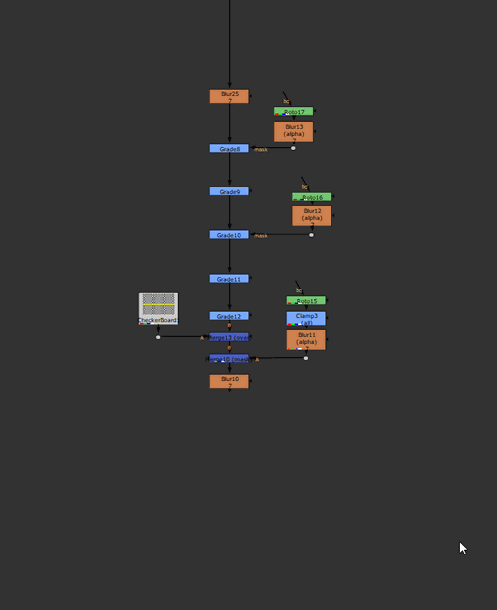

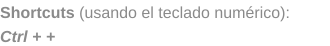

<br>


##  Push Nodes v1.0 | Mitja Müller-Jend

[http://www.nukepedia.com/python/nodegraph/push_nodes](http://www.nukepedia.com/python/nodegraph/push_nodes)<br>
Pushes nodes to make room in the direction set by the
shortcut, using the mouse pointer position as the pivot. It takes
backdrops into account, making room inside them without moving nodes in
other backdrops, so it's best not to leave nodes outside
a backdrop. Useful to make room when you need to add new nodes in
a crowded area.

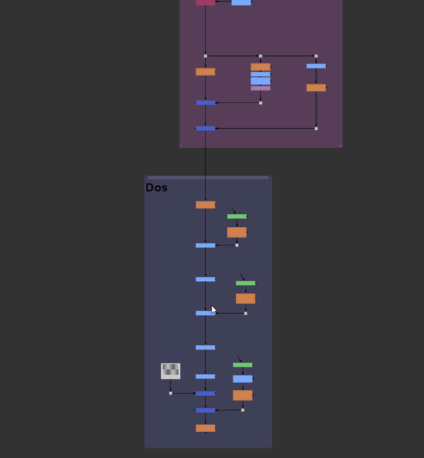

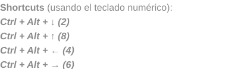

<br>


##  Pull Nodes v1.0 | Mitja Müller-Jend \| Mod Lega

[http://www.nukepedia.com/python/nodegraph/push_nodes](http://www.nukepedia.com/python/nodegraph/push_nodes)<br>
A simple mod of *Push Nodes* that does exactly the opposite: it shrinks
the space in the direction set by the shortcut, using
the mouse pointer as the pivot.

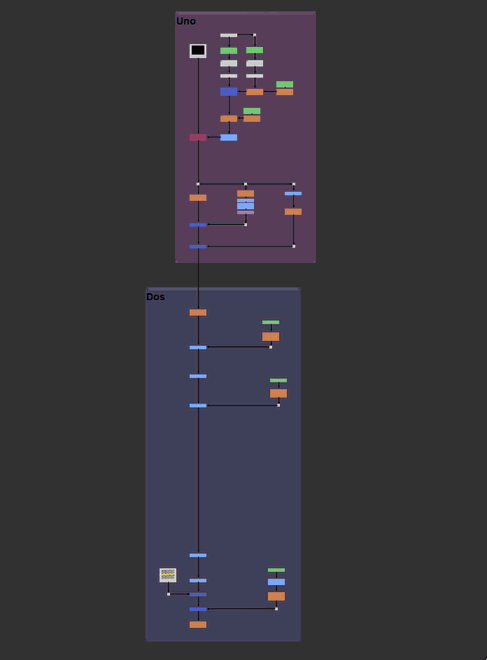

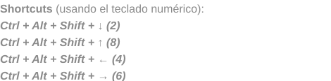

<br>


##  Easy Navigate v2.3 | Hossein Karamian

[https://www.nukepedia.com/python/nodegraph/km-nodegraph-easy-navigate/](https://www.nukepedia.com/python/nodegraph/km-nodegraph-easy-navigate/)<br>
Creates bookmarks for the selected nodes and lets you jump quickly
from one to another. Useful for large scripts.

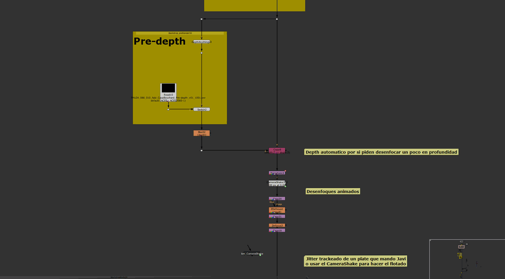


<br>


##  Toggle Zoom v1.1 | Lega

Toggles between the current zoom and a zoom that shows all the nodes in the
Node Graph.<br>
It lets you go back to the previous zoom level, using the cursor position
as the center. If more than 9 seconds pass between presses of the H key,
the cycle restarts.

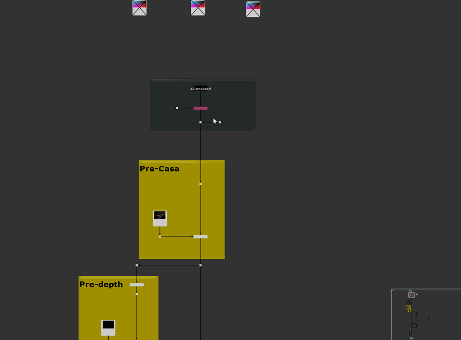


<br>
