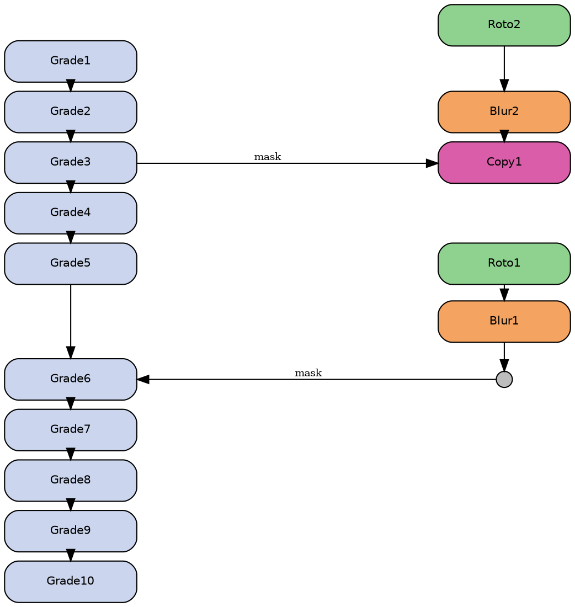

# LGA Arrange Nodes — Research Log

Last updated: 2026-02-04

## Goal
Build a pure-Python layout core (no Nuke) to explore and validate the column‑ordering logic.  
Then translate the validated logic into the Nuke script.

## Current Phase
**Phase 1 — Pure logic + readable graph generator**

### Phase 1 progress (so far)
- Added pure-Python core (`layout_core.py`) with:
  - Baseline column distribution
  - Alignment constraints
  - Segment-based overlap resolution
- Added example graph builder (`graph_examples.py`) using the approved layout
- Added Graphviz DOT export (`graphviz_export.py`)
- Added CLI to dump before/after (`layout_cli.py`)

### Latest run (2026-02-04)
- Command: `python3 layout_cli.py`
- Result: layout produces aligned Y for `Grade3 -> Copy1` and `Dot1 -> Grade6`.
- Baseline distribution equalized spacing in the principal column (removed the large gap between Grade5 and Grade6).
- No overlap conflicts detected with `min_gap=0.2`.
- Open question: should baseline distribution be applied by default (removing original gaps) or only when resolving conflicts?

### Latest run (2026-02-04, Example2)
- Command: `python3 layout_cli.py`
- Result: layout keeps equal spacing and aligns:
  - `Grade3 -> Copy1`
  - `Dot1 -> Grade6`
  - `Dot2 -> Merge1`
- No overlap conflicts detected with `min_gap=0.2`.
- Principal column did **not** need extra re-accommodation to fit secondary columns in this case.

### Update (2026-02-04)
- Fixed: left column now modeled as a **single column** with **two subgroups** (no fake columns).
- Added principal-column distribution with **fixed anchors** (nodes connected by alignment).
- Principal column is **not baseline-distributed**; it is distributed **after alignment** using fixed anchors.

### New Example (2026-02-04) — Example3
- Added a more complex graph with:
  - Extra far-right column
  - Multiple subgroups on the left and right
  - Misaligned X positions (jittered)
  - Multiple alignment constraints to principal column
- Generated via `example_complex_graph()` and exported through `layout_cli.py`.

### Update (2026-02-04)
- Added X-alignment pass per column (align to average original X).
- Columns now render aligned in DOT output even if input X is jittered.

### Update (2026-02-04)
- Height-aware distribution implemented:
  - Uses bounding boxes (center ± height/2).
  - Equal gaps between node boxes, not just between centers.
  - Graphviz export now sets per-node height (so tall nodes are visible).

### Phase 1 tasks
1. Define data structures and a minimal layout engine (no Nuke).
2. Create a readable graph description format (DSL) and DOT export.
3. Replicate the user’s example graph and verify before/after in Graphviz.
4. Add overlap detection and constraint checks.
5. Iterate until rules are satisfied for the example.

## Rules / Discoveries (confirmed)
1. **Vertical order is preserved** within each column (original order never changes).
2. **Connection alignment rule:** if a node is connected across columns, it must share the same Y as the connected node.
3. **Priority for conflicting connections:** the connection to the **principal column** wins; otherwise, the connection to the **closest-to-principal column** wins.
4. **Distribution baseline:** nodes are distributed vertically as equidistant as possible based on the current column/subgroup height.
5. **Overlap resolution priority:**
   - First, push the **secondary** column subgroup down to clear overlaps.
   - If there is insufficient space, then adjust the **principal** column.
6. **No overlaps are acceptable** (avoid at all cost).
7. **Graphviz export** must be provided so the user can compare before/after at https://dreampuf.github.io/GraphvizOnline.
8. **Baseline distribution is always applied** (equal spacing ideal), then corrective moves happen only if needed.

## Example Graph (target)
The user validated the following DOT as closest to the original:

## Notes
- The example enforces: `Copy1` aligned to `Grade3` and `Dot1` aligned to `Grade6`.
- `Roto1` is the **top** of its subgroup and is **not** connected to `Copy1`.
